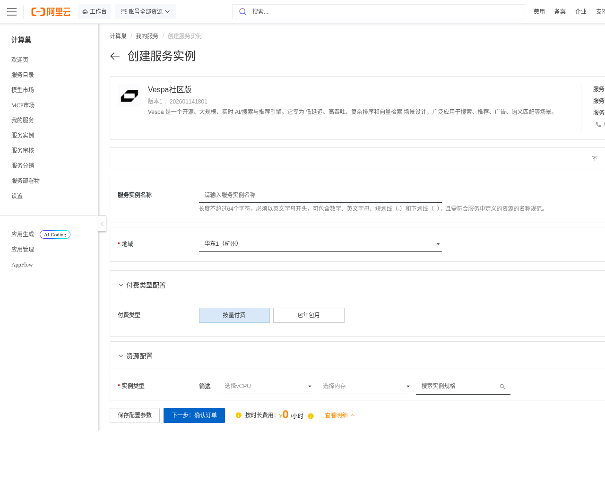
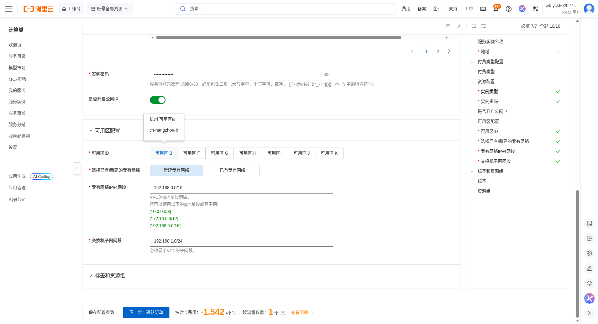
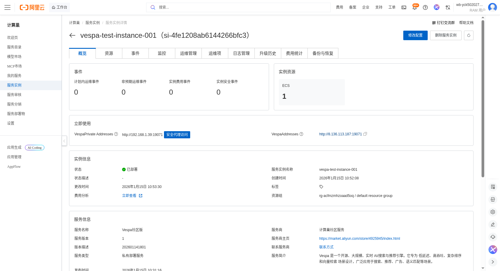

# Vespa社区版计算巢服务实例使用文档

## 概述

Vespa社区版是阿里云提供的分布式搜索引擎服务，支持实时数据处理和高效的全文搜索。它适用于大规模数据的快速检索和分析。Vespa由阿里云开发，提供高性能和可扩展性，能够处理结构化数据、非结构化文本和向量数据，并支持实时索引和查询。

## 部署操作流程

1. 点击链接：[部署链接](https://computenest.console.aliyun.com/service/simple/deploy?ServiceId=service-797b8c9ff469412db022)，进入服务实例部署界面，根据界面提示，填写参数。

    

2. 查看价格信息，在表单页面中可以查看不同配置对应的价格。

3. 确认所有配置信息无误后，点击"创建实例"按钮提交订单：

    

4. 等待服务实例创建完成，可以在服务详情页监控部署进度：

    

5. 当服务实例状态显示为"已部署"时，表示部署成功。

    

## 官方网站

更多信息请访问官方文档：[Vespa官方文档](https://docs.vespa.ai/)